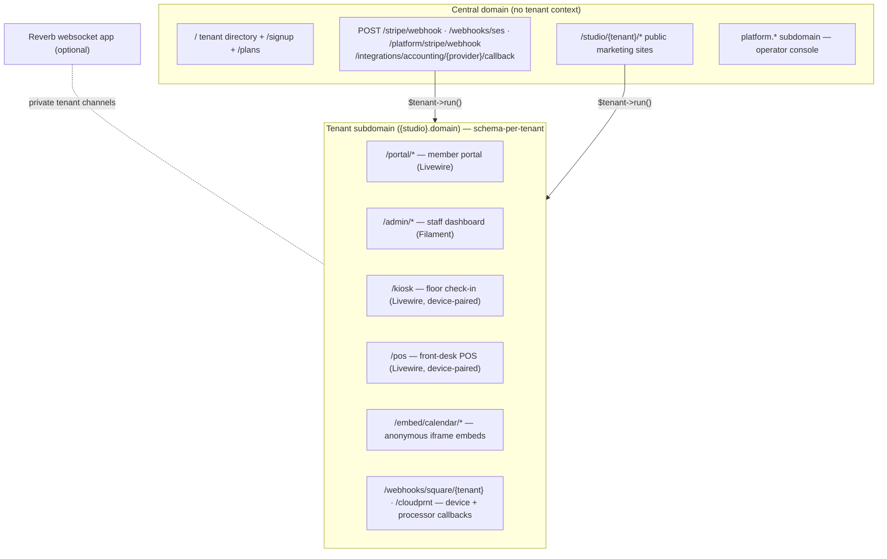

# 1. System Overview

## What MakerHearth is

A multi-tenant SaaS platform that runs a pottery/ceramics studio end to end.
Each studio is a **tenant** on its own subdomain with its own Postgres schema.
The platform operator runs the business from a separate, central console.

The product covers, per studio:

- **Studio time** — kiosk check-in/checkout on the studio floor, auto-billed
  billable minutes, PIN/QR check-in, a front-desk POS with monitor shifts,
  card readers, a receipt printer and cash drawer.
- **Firing** — kilns, kiln loads (a strict forward state machine), and an
  immutable firing-credit ledger (consume on unload, peer transfers, packages).
- **Memberships** — tiered benefits, Stripe Connect subscriptions, family
  members, applications, tier-gated catalog pricing.
- **Classes** — templates → offerings → sessions, enrollment with waitlist
  promotion, recurring offerings, attendance, prerequisites/certifications,
  substitute-instructor requests.
- **Private lessons & parties** — teacher availability with buffer times,
  slot algorithm, lesson packages, private group bookings (parties).
- **Events** — ticket types (incl. table tickets), eligibility rules, waitlists.
- **Commerce** — cart → order → settlement, passes, store products, store
  credit, gift cards, stackable promo codes, sales tax, receipt PDFs, refunds
  (policy engine, decision vs. movement split), Stripe or Square as the card
  processor.
- **Space rentals** — shelves, lockers and studio spaces rented monthly, with
  a signed agreement, Stripe subscription billing and a waitlist.
- **Fundraising** — donations, funds, campaigns, peer fundraisers, pledges,
  planned gifts, securities gifts, IRS-compliant tax receipts (PDF), a donor
  lite-CRM, grants pipeline with deadline reminders, impact reporting.
- **Communications** — a trigger-driven email-automation engine (with SMS/push
  channels and A/B variants), bulk campaigns over SES, suppression lists,
  behavioral/dormancy/lifecycle re-engagement.
- **Public web presence** — a block-based marketing-site builder with SEO,
  themes, embeds for external sites (e.g. Squarespace), and privacy-respecting
  pageview analytics.
- **Back office** — declarative reports + custom report builder, payroll
  exports, inventory/tasks/recipes, gallery consignment, shows, call for
  entry and artist payouts, volunteer/board management, the studio's own
  written procedures, waivers, guardianships, owner-defined staff roles,
  member growth and churn metrics, accounting sync (QuickBooks Online, Xero,
  Zoho Books, or a file export), data import from another system, and BCP
  offline reconcile.

And for the platform operator: tenant lifecycle (suspend/offboard), cross-tenant
error capture, tenant billing (plans, add-ons, annual billing, discounts),
self-serve signup, a support-ticket queue, and studio growth metrics. See [07-platform-operations.md](07-platform-operations.md).

## The five HTTP surfaces



| Surface | Route file | Auth | UI stack |
|---|---|---|---|
| Central (directory, signup, webhooks, marketing pages) | `routes/web.php` | mostly anonymous; webhooks signature-verified | Blade |
| Platform operator console | `routes/web.php` (platform subdomain) | `platform_admin` guard, mandatory TOTP | Blade + controllers |
| Member portal | `routes/tenant.php` | tenant `users` session | Livewire 3 |
| Staff admin | one Filament panel (tenant middleware), sidebar scoped to the section you're in | tenant `users` with role flags + owner-defined staff roles | Filament 3 |
| Kiosk / POS | `routes/tenant.php` | paired-device token + PIN, no user session | Livewire 3 |
| Receipt printer | `/cloudprnt` (tenant) | the printer polls with HTTP Basic, device token as password | Star CloudPRNT |

Key boundary rule: **webhooks and public marketing pages live on central
routes** and switch into a tenant with `$tenant->run(fn () => …)` after
resolving the tenant from event metadata / the URL. The platform console
**never** loads tenancy middleware.

## Tech stack

| Layer | Choice | Why |
|---|---|---|
| Framework | Laravel 12, PHP 8.4, strict types | Full-stack batteries: container, Eloquent, queues, mail, scheduler |
| Multi-tenancy | stancl/tenancy v3 | Subdomain identification + schema-per-tenant + tenant-aware queues/cache |
| Database | PostgreSQL 16 (+ Redis) | Schema-per-tenant requires it; partial unique indexes used heavily |
| Staff admin | Filament 3 | 100 resources in one panel replace a hand-built admin |
| Portal / kiosk / POS | Livewire 3 + Alpine + Tailwind (compiled, not CDN) | Server-held state, light DOM updates |
| Payments | stripe-php v17 directly, behind a per-call wrapper; Square over HTTP as a second processor | Cashier was evaluated and **dropped** — its single-account model fights Connect-per-tenant. Both processors sit behind one `CardProcessor` contract |
| Live updates | Laravel Reverb (separate Dokku app) + Echo | optional; every live screen keeps polling as the safety net |
| Money | brick/money — integer cents, banker's rounding | Never float; shared `MoneyMath::percentOfCents()` |
| Email | Laravel Mail + SES; SNS webhook with real signature verification | Deliverability feedback (bounce/complaint) drives suppression |
| Audit | spatie/laravel-activitylog | Field-level history on audit-sensitive models |
| PDF | barryvdh/laravel-dompdf | Year-end tax receipts, order receipts |
| Platform-admin MFA | laravel/fortify (TOTP only, routes suppressed elsewhere) | Never wired to tenant surfaces |
| Observability | laravel/pulse + queue/scheduler heartbeat commands | See `docs/OBSERVABILITY.md` in the private production repo |
| Testing | Pest 3 | ~800 files, ~5,000 tests |
| Deploy | Dokku on a single Hetzner VM | Zero PaaS cost pre-revenue; Forge is the later target |

Notable **deliberate absences**: no Statamic (the public site is Filament/Blade
by decision), no Laravel Cashier, no `SoftDeletes` trait (see
[patterns](04-architectural-patterns.md#soft-delete-via-is_active)), no
raw-SQL data access outside migrations.

## Codebase shape

```
app/
  Console/Commands/       96 Artisan commands (crons + ops)
  DataObjects/            immutable value objects (RefundDecision, EffectiveBenefits, …)
  Enums/                  138 backed enums, cast on models
  Exceptions/             domain exceptions (WaiverNotSigned, ClassOfferingFull, …)
  Filament/               100 resources + settings pages + dashboards + widgets (staff /admin)
  Http/Livewire/          Portal/ (53) · Kiosk/ · Pos/ (with Concerns/ traits) · Staff/
  Http/Controllers/       webhooks, marketing site, platform console, onboarding
  Jobs/                   6 tenant-aware queued jobs
  Models/                 220 Eloquent models
  Observers/              13 model observers (invariant enforcement + live-update emission)
  Services/               271 classes in 47 domain namespaces — the domain API
  Support/                shared primitives (MoneyMath, TenantTime, ClientIp, …)
  Themes/                 theme catalog value objects
routes/
  web.php                 central + platform routes
  tenant.php              portal, kiosk, POS, embeds, live-channel auth, CloudPRNT
  console.php             the scheduler (every tenant cron wrapped in tenants:run-all)
database/migrations/      68 central
database/migrations/tenant/  326 tenant
tests/                    Unit/ (pure logic) + Feature/ (tenant-scoped integration)
```

The single most important structural rule: **domain writes go through
`app/Services/`**. Models are thin; controllers/Livewire/Filament call services;
services own transactions, locks, gates, and side effects. See
[04-architectural-patterns.md](04-architectural-patterns.md).
