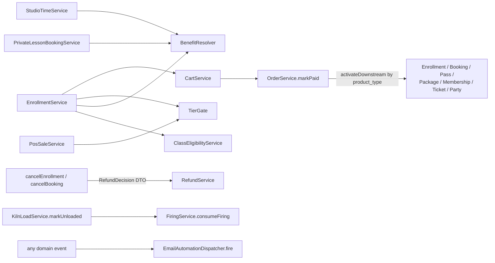

# 3. Domain Map

The 174 models and 182 services are organized into the domain namespaces below
(`app/Services/<Domain>/`). Each domain exposes **service classes as its API**;
models are thin. Cross-domain calls go service → service (e.g. enrollment calls
the benefit resolver and the cart service), never model → model.

## Core studio operations

### Operations (studio time, kiosk, POS)
- **Models:** `StudioSession`, `Kiosk`, `POSTerminal`, `MonitorShift`, `BcpDevice`/`BcpEvent`
- **Services:** `Operations/StudioTimeService` (check-in/out; checkout bills
  billable minutes as a STUDIO_TIME cart line and records a `PassRedemption`
  when a pass covers the visit), `Pos/PosCheckoutService`, `Pos/PosSaleService`,
  `Pos/PosRefundService`, `Pos/MonitorShiftService`, `Bcp/*` (offline reconcile)
- **Shape:** the kiosk is device-paired (hashed token, no user session); the POS
  adds monitor shifts — one open shift per (monitor, terminal) via a partial
  unique index; every checkout/sale/refund is shift-attributed; inactivity lock
  + forgotten-shift auto-close. Members can also check in by PIN or QR.

### Firing
- **Models:** `Kiln`, `KilnLoad`, `Firing`, `FiringLedgerEntry` (immutable),
  `FiringAdjustment`, `FiringTransfer`, `FiringPackageProduct`,
  `FiringPackagePurchase`, `VolunteerFiringGrant`
- **Services:** `FiringService` (balance + consume-on-unload),
  `FiringAdjustmentService`, `FiringTransferService`, `KilnLoadService`
- **Shape:** the flagship ledger domain. Balance is computed, never stored;
  entries are immutable; `consumeFiring` runs on kiln-load **unload** (damaged/
  aborted loads never bill); every balance mutation row-locks the user.
  `KilnLoad` is a strictly-forward state machine
  (LOADING → READY_TO_FIRE → FIRING → COOLING → READY_TO_UNLOAD → UNLOADED,
  ABORTED from any pre-terminal state).

### Waivers & identity
- **Models:** `WaiverDocument`, `WaiverSignature` (immutable; optional drawn
  signature image), `WaiverRevocation`, `GuardianRelationship`
- **Services:** `Waivers/WaiverService`, `Identity/*`
- **Shape:** the waiver is a **universal gate** — checked at every activity
  entry point via `WaiverService::hasCurrentWaiver()`. Signatures are never
  edited or deleted; revocation is a separate row. `profileComplete()` is the
  second universal gate and fires first.

## Catalog & commerce

### Orders
- **Models:** `Cart`, `CartLineItem`, `Order`, `OrderLineItem`, `OrderRefund`,
  `OrderRefundLineItem`, `StoreCreditEntry` (immutable ledger)
- **Services:** `Orders/CartService`, `Orders/OrderService`,
  `Credits/StoreCreditService`, `Billing/RefundService`
- **Shape:** `OrderService::markPaid()` is the **single "order paid" contract**;
  Stripe reaches it via `markPaidFromIntent()`, manual settlement via
  `settleOrder()`. Downstream activations (enrollment, booking, pass, package,
  membership, ticket, party) dispatch by `product_type` inside `markPaid`.
  Line items snapshot price + terms at add-time.

### Memberships & benefits
- **Models:** `Membership`, `MembershipTier` (with `tier_level`),
  `MembershipApplication`, `BenefitPackage`, `MembershipFamilyMember`,
  `FreeClassLedgerEntry`
- **Services:** `Memberships/MembershipService`, `BenefitResolver`,
  `TierGate`, `MembershipApplicationService`, `FamilyMemberService`,
  `Billing/SubscriptionService` (custom Connect subscriptions — **not** Cashier)
- **Shape:** `BenefitResolver` is the single benefit contract, aggregating
  active Membership + PassPurchase + VolunteerAssignment + BoardTerm
  (max-for-discounts, OR-for-booleans, sum-for-allowances). `TierGate` is the
  single tier-gating/pricing contract — every catalog surface (passes, classes,
  events, products, firing packages) gates and tier-prices through it, with
  no discount stacking.

### Passes
- **Models:** `PassType` (with `PassCreditType` + `credit_count`),
  `PassPurchase`, `PassRedemption` (immutable, unique per redeemed item)
- **Services:** `Passes/PassRedemptionService` (row-locked, idempotent;
  remaining credits computed from redemption rows)
- **Shape:** STUDIO_TIME passes waive floor time; CLASS_ENROLLMENT /
  PRIVATE_LESSON credits enroll/book at $0 through the benefit waterfall.

### Products & inventory
- **Models:** `Product` (+ `ClayProduct` subclass), `InventoryAdjustment`,
  `Task`, `TaskTemplate`, `RecipeBatch`, `RecipeFormulation`
- **Services:** `Inventory/InventoryService` (pure `decideCanPurchase` +
  reserve/release), `Inventory/*` task/recipe services

## Scheduling domains

### Classes
- **Models:** `ClassTemplate`, `ClassOffering`, `ClassSession`, `ClassCategory`,
  `Enrollment`, `Attendance`, `ClassRecurrence`, `RecurringEnrollment`,
  `SubstituteRequest`, `Certification`, `UserCertification`
- **Services:** `Classes/EnrollmentService` (capacity/waitlist branch, benefit
  waterfall, tier pricing, mid-cycle proration), `ClassEligibilityService`
  (age/prereq/certification/tier gates), `ClassSessionService`,
  `ClassRecurrenceService`, `RecurringEnrollmentService`, `AttendanceService`,
  `SubstituteRequestService`
- **Shape:** the **effective-instructor waterfall** —
  `ClassSession::effective_instructor = instructor_override ?? offering->primary_instructor`;
  substitute approval sets the override; payroll reads the accessor.

### Lessons & parties
- **Models:** `TeacherProfile` (buffer minutes), `LessonType`,
  `TeacherLessonOffering`, `TeacherAvailability`(+`Exception`),
  `PrivateLessonBooking`, `LessonPackage*`, `PartyType`,
  `TeacherPartyOffering`, `PartyBooking`, `PartyAttendee`,
  `GoogleCalendarPushSubscription`
- **Services:** `Lessons/AvailabilityService` (recurring + exceptions + buffer
  padding + booking-window guards), `PrivateLessonBookingService`,
  `Parties/*`, `Calendar/CalendarSyncService` + `GoogleCalendarClient`
  (config-gated incremental push sync; polling fallback)

### Events
- **Models:** `Event`, `EventTicketType` (eligibility `available_to` +
  tier price override), `EventTicket` (incl. TABLE tickets), waitlist models
- **Services:** `Events/EventTicketService`, `EventEligibility`

## Money-adjacent domains

### Billing (Stripe)
- `Billing/StripeClient` — per-call wrapper threading the tenant's connected
  account; **Stripe is optional everywhere** (short-circuits on
  `StripeNotConfigured`). See [05-payments-and-billing.md](05-payments-and-billing.md).

### Donations / fundraising / grants
- **Models:** `Fund`, `Donation` (FMV, dedications, campaign/pledge/peer FKs),
  `TaxReceipt`, `DonorProfile`, `DonorInteraction` (append-only),
  `FundraisingCampaign`, `PeerFundraiser`, `Pledge`, `PlannedGift`,
  `SecuritiesGift`, `DonationSoftCredit`, `MatchingGiftEmployer`,
  `Scholarship`, `ProgramCategory`, `Funder`, `GrantApplication`
  (+ status history), `GrantReport`
- **Services:** `Donations/*` (DonationService, TaxReceiptService +
  Mailer/Pdf, StewardshipService, LapsedDonorService, SoftCreditService,
  PledgeService, SecuritiesGiftService, PeerFundraiserService),
  `Grants/GrantService` (row-locked status transitions + append-only history),
  `GrantReminderService`
- **Shape:** campaign/pledge totals are **computed, never stored**; tax
  receipts split deductible vs. FMV per IRS Pub 1771 and email a PDF,
  idempotently.

### Payroll & reporting
- **Models:** `PayPeriod`, `PayrollExport`(+LineItems), `TeacherPayout`
  (a read-model mapped onto `payroll_export_line_items` — one source of truth),
  `Report`, `ReportCategory`, `ReportRun`, `ScheduledReport`, `NightlyReport`
- **Services:** `Payroll/*`, `Reporting/ReportRunner`, `CustomReportBuilder`,
  `SourceRegistry`, `CallableRegistry` (registered callables power impact/
  demographics/grant-deadline reports), `Scheduling` (email delivery with CSV)

### Gallery
- **Models:** `GalleryItem`, `GallerySale` (immutable, unique per item),
  `ArtistProfile`, `ArtistPayout*`
- **Services:** `Gallery/GalleryConsignmentService` (idempotent `markSold`),
  payout pipeline

## People & governance

### Volunteers & board
- **Models:** `VolunteerRole` (required-qualifications gating),
  `VolunteerAssignment`, `VolunteerProfile`, `BoardPosition`, `BoardTerm`
  (shelf choice; issues FREE_CLASS credits per term via observer)
- Feed into `BenefitResolver` as benefit sources.

## Communications & web

### Messaging
The email-automation engine, bulk campaigns, suppression, re-engagement —
large enough for its own doc: [06-messaging-and-email.md](06-messaging-and-email.md).

### Marketing / Media / Theme / AI
The public-site block builder, media library, theme catalog, and config-gated
AI assists: [08-public-site-and-theming.md](08-public-site-and-theming.md).

### Platform
The operator console (lifecycle, errors, billing, signup, tickets):
[07-platform-operations.md](07-platform-operations.md).

## Cross-domain seams (the calls that matter)

Three resolvers are **single contracts** — new sources/surfaces plug into them,
never into call sites: `BenefitResolver` (what a user gets),
`TierGate` (what a user may buy and at what price),
`EmailAutomationDispatcher` (every transactional communication).
