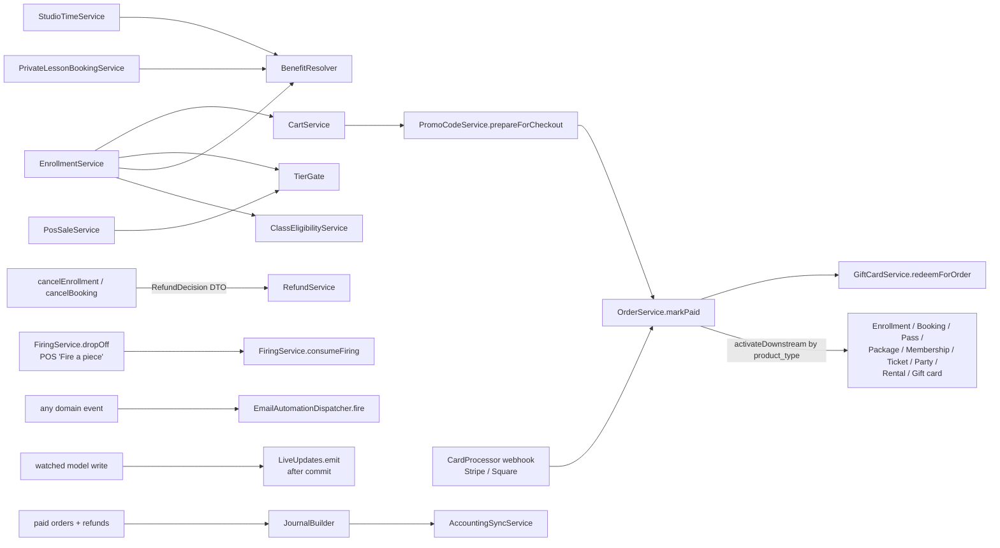

# 3. Domain Map

The 221 models and 270 service classes are organized into the domain namespaces below
(`app/Services/<Domain>/`). Each domain exposes **service classes as its API**;
models are thin. Cross-domain calls go service → service (e.g. enrollment calls
the benefit resolver and the cart service), never model → model.

## Core studio operations

### Operations (studio time, kiosk, POS)
- **Models:** `StudioSession`, `Kiosk`, `POSTerminal`, `MonitorShift`,
  `PaymentTerminalReader`/`Location`, `ReceiptPrinter`, `PrintJob`,
  `DrawerOpening` (immutable), `BcpDevice`/`BcpEvent`
- **Services:** `Operations/StudioTimeService` (check-in/out; checkout bills
  billable minutes as a STUDIO_TIME cart line and records a `PassRedemption`
  when a pass covers the visit), `Pos/PosCheckoutService`, `Pos/PosSaleService`,
  `Pos/PosRefundService`, `Pos/PosCartService`, `Pos/MonitorShiftService`,
  `Payments/TerminalService` + `TerminalReconcileService` (card readers,
  offline store-and-forward), `Printing/ReceiptPrintService`, `Bcp/*`
  (offline reconcile)
- **Shape:** the kiosk is device-paired (hashed token, no user session); the POS
  adds monitor shifts — one open shift per (monitor, terminal) via a partial
  unique index; every checkout/sale/refund is shift-attributed; inactivity lock
  + forgotten-shift auto-close. Members can also check in by PIN or QR. The
  cart is per patron, not per terminal, so a charge carries the line ids the
  screen showed and is refused if another terminal changed the cart. Card
  readers are server-driven (Stripe or Square Terminal); the receipt printer
  pulls jobs over Star CloudPRNT and kicks the cash drawer; with no printer
  paired the whole path is inert.

### Firing
- **Models:** `Kiln`, `KilnLoad`, `Firing`, `FiringLedgerEntry` (immutable),
  `FiringAdjustment`, `FiringTransfer`, `FiringPackageProduct`,
  `FiringPackagePurchase`, `VolunteerFiringGrant`
- **Services:** `FiringService` (balance + charge at drop-off),
  `FiringAdjustmentService`, `FiringTransferService`, `KilnLoadService`
- **Shape:** the flagship ledger domain. Balance is computed, never stored;
  entries are immutable; `consumeFiring` runs at front-desk **drop-off** (one
  record per firing; no kiln step charges, so a failed firing is refired free);
  every balance mutation row-locks the user. Studios choose one payment for
  bisque + glaze or one per firing, and standard (drop-off + pick-up) or
  detailed (pieces in loads) tracking.
  `KilnLoad` is a strictly-forward state machine
  (LOADING → READY_TO_FIRE → FIRING → COOLING → READY_TO_UNLOAD → UNLOADED,
  ABORTED from any pre-terminal state).

### Waivers & identity
- **Models:** `WaiverDocument`, `WaiverSignature` (immutable; optional drawn
  signature image), `WaiverRevocation`, `GuardianRelationship`
- **Services:** `Waivers/WaiverService`, `Identity/*`
- **Shape:** the waiver is a **universal gate** — checked at every activity
  entry point via `WaiverService::hasCurrentWaiver()`. Signatures are never
  edited or deleted; revocation is a separate row. `profileComplete()` is the
  second universal gate and fires first.

## Catalog & commerce

### Orders
- **Models:** `Cart`, `CartLineItem`, `Order`, `OrderLineItem`, `OrderPayment`
  (split-tender ledger), `OrderRefund`, `OrderRefundLineItem`,
  `StoreCreditEntry` (immutable ledger), `GiftCard` +
  `GiftCardLedgerEntry` (immutable), `CartGiftCard`, `PromoCode` +
  `PromoCodeTarget` + `PromoRedemption` (immutable), `TaxRate`
- **Services:** `Orders/CartService`, `Orders/OrderService`,
  `Credits/StoreCreditService`, `Billing/RefundService`,
  `GiftCards/GiftCardService`, `Promotions/PromoCodeService`,
  `Tax/SalesTax` (+ the pure `TaxCalculator`), `Orders/OrderReceiptPdf`
- **Shape:** `OrderService::markPaid()` is the **single "order paid" contract**;
  Stripe reaches it via `markPaidFromIntent()`, manual settlement via
  `settleOrder()`. Downstream activations (enrollment, booking, pass, package,
  membership, ticket, party, rental, gift card) dispatch by `product_type`
  inside `markPaid`. Line items snapshot price + terms at add-time.
- **Tax** is computed once, in the three line creators, and **included in
  the line's `total_cents`** (`tax_cents` snapshotted beside it), so
  checkout, readers, refunds and store-credit caps carry it unchanged.
  Anything meaning "the price of the goods" reads `total − tax`.
- **Gift cards are a tender, not a discount line**: `orders.total_cents`
  stays the full price and `gift_card_cents` records the part gift cards
  paid. Codes are never stored, only an HMAC plus the last four digits.
- **Promo codes stack**, each covers only what's assigned to it, and a line
  covered by two takes the single best discount, folded into the line's
  `discount_cents` with tax recomputed at the line's frozen rate.

### Card processors
- **Contract:** `App\Contracts\Payments\CardProcessor` (hosted checkout,
  reader payments, refunds, saved cards, `normalizeEvent()` →
  `ProcessorEvent`), resolved per studio by `CardProcessorManager`, which
  never throws (an unknown or unconfigured choice gets an "unavailable"
  processor).
- **Implementations:** `StripeCardProcessor` (the studio's Connect account)
  and `SquareCardProcessor` (the studio's own Square account: payment links,
  Square Terminal, cards on file). Orders record `payment_processor` +
  `processor_payment_ref`; a void or refund uses the processor that took
  the payment, not today's setting.

### Space rentals
- **Models:** `RentalSpaceType` → `RentalUnit` → `RentalAssignment`
  (PENDING / ACTIVE / ENDING / ENDED, price snapshotted), `RentalWaitlistEntry`
- **Services:** `Rentals/RentalService` (the only write path),
  `RentalBilling` (Stripe subscription on the studio's account),
  `RentalWaitlistService`
- **Shape:** capacity is derived from active units, never stored. One live
  renter per unit is enforced twice: a row lock on the unit and a partial
  unique index. A rental type can require its own signed agreement (an
  inactive waiver document signed on its own). A freed unit is offered to
  the next person waiting for 48 hours and counts as taken meanwhile.

### Memberships & benefits
- **Models:** `Membership`, `MembershipTier` (with `tier_level`),
  `MembershipApplication`, `BenefitPackage`, `MembershipFamilyMember`,
  `FreeClassLedgerEntry`
- **Services:** `Memberships/MembershipService`, `BenefitResolver`,
  `TierGate`, `MembershipApplicationService`, `FamilyMemberService`,
  `Billing/SubscriptionService` (custom Connect subscriptions — **not** Cashier)
- **Shape:** `BenefitResolver` is the single benefit contract, aggregating
  active Membership + PassPurchase + VolunteerAssignment + BoardTerm
  (max-for-discounts, OR-for-booleans, sum-for-allowances). `TierGate` is the
  single tier-gating/pricing contract — every catalog surface (passes, classes,
  events, products, firing packages) gates and tier-prices through it, and
  `TierGate::resolvePricing()` is the one override-vs-discount rule (the
  member pays the lower, never both).

### Passes
- **Models:** `PassType` (with `PassCreditType` + `credit_count`),
  `PassPurchase`, `PassRedemption` (immutable, unique per redeemed item)
- **Services:** `Passes/PassRedemptionService` (row-locked, idempotent;
  remaining credits computed from redemption rows)
- **Shape:** STUDIO_TIME passes waive floor time; CLASS_ENROLLMENT /
  PRIVATE_LESSON credits enroll/book at $0 through the benefit waterfall.

### Products & inventory
- **Models:** `Product` (+ `ClayProduct` subclass), `InventoryAdjustment`,
  `Task`, `TaskTemplate`, `RecipeBatch`, `RecipeFormulation`
- **Services:** `Inventory/InventoryService` (pure `decideCanPurchase` +
  reserve/release), `Inventory/*` task/recipe services

## Scheduling domains

### Classes
- **Models:** `ClassTemplate`, `ClassOffering`, `ClassSession`, `ClassCategory`,
  `Enrollment`, `Attendance`, `ClassRecurrence`, `RecurringEnrollment`,
  `SubstituteRequest`, `Certification`, `UserCertification`
- **Services:** `Classes/EnrollmentService` (capacity/waitlist branch, benefit
  waterfall, tier pricing, mid-cycle proration), `ClassEligibilityService`
  (age/prereq/certification/tier gates), `ClassSessionService`,
  `ClassRecurrenceService`, `RecurringEnrollmentService`, `AttendanceService`,
  `SubstituteRequestService`
- **Shape:** the **effective-instructor waterfall** —
  `ClassSession::effective_instructor = instructor_override ?? offering->primary_instructor`;
  substitute approval sets the override; payroll reads the accessor.

### Lessons & parties
- **Models:** `TeacherProfile` (buffer minutes), `LessonType`,
  `TeacherLessonOffering`, `TeacherAvailability`(+`Exception`),
  `PrivateLessonBooking`, `LessonPackage*`, `PartyType`,
  `TeacherPartyOffering`, `PartyBooking`, `PartyAttendee`,
  `GoogleCalendarPushSubscription`
- **Services:** `Lessons/AvailabilityService` (recurring + exceptions + buffer
  padding + booking-window guards), `PrivateLessonBookingService`,
  `Parties/*`, `Calendar/CalendarSyncService` + `GoogleCalendarClient`
  (config-gated incremental push sync; polling fallback)

### Events
- **Models:** `Event`, `EventTicketType` (eligibility `available_to` +
  tier price override), `EventTicket` (incl. TABLE tickets), waitlist models
- **Services:** `Events/EventTicketService`, `EventEligibility`

## Money-adjacent domains

### Billing (Stripe)
- `Billing/StripeClient` — per-call wrapper threading the tenant's connected
  account; **Stripe is optional everywhere** (short-circuits on
  `StripeNotConfigured`). See [05-payments-and-billing.md](05-payments-and-billing.md).

### Donations / fundraising / grants
- **Models:** `Fund`, `Donation` (FMV, dedications, campaign/pledge/peer FKs),
  `TaxReceipt`, `DonorProfile`, `DonorInteraction` (append-only),
  `FundraisingCampaign`, `PeerFundraiser`, `Pledge`, `PlannedGift`,
  `SecuritiesGift`, `DonationSoftCredit`, `MatchingGiftEmployer`,
  `Scholarship`, `ProgramCategory`, `Funder`, `GrantApplication`
  (+ status history), `GrantReport`
- **Services:** `Donations/*` (DonationService, TaxReceiptService +
  Mailer/Pdf, StewardshipService, LapsedDonorService, SoftCreditService,
  PledgeService, SecuritiesGiftService, PeerFundraiserService),
  `Grants/GrantService` (row-locked status transitions + append-only history),
  `GrantReminderService`
- **Shape:** campaign/pledge totals are **computed, never stored**; tax
  receipts split deductible vs. FMV per IRS Pub 1771 and email a PDF,
  idempotently.

### Payroll & reporting
- **Models:** `PayPeriod`, `PayrollExport`(+LineItems), `TeacherPayout`
  (a read-model mapped onto `payroll_export_line_items` — one source of truth),
  `Report`, `ReportCategory`, `ReportRun`, `ScheduledReport`, `NightlyReport`
- **Services:** `Payroll/*`, `Reporting/ReportRunner`, `CustomReportBuilder`,
  `SourceRegistry`, `CallableRegistry` (registered callables power impact/
  demographics/grant-deadline reports), `Scheduling` (email delivery with CSV)

### Gallery
- **Models:** `GalleryItem`, `GallerySale` (immutable, unique per item),
  `ArtistProfile` (guest artists have no user account), `ArtistPayout*`,
  `GalleryShow`, `GalleryPlacement`, `GallerySubmission`
- **Services:** `Gallery/GalleryConsignmentService` (idempotent `markSold`),
  `GallerySaleService` (row-locked; a duplicate delivery returns the
  existing sale), `GallerySubmissionService` (public call for entry with
  per-artist caps and entry fees), `Square/*` (register sync over a
  HMAC-verified webhook + a reconcile cron), payout pipeline paying from the
  sale-time commission snapshot

## People & governance

### Volunteers & board
- **Models:** `VolunteerRole` (required-qualifications gating),
  `VolunteerAssignment`, `VolunteerProfile`, `BoardPosition`, `BoardTerm`
  (shelf choice; issues FREE_CLASS credits per term via observer)
- Feed into `BenefitResolver` as benefit sources.

### Procedures
- **Models:** `Procedure` (draft body, audience, required flag, review
  date), `ProcedureVersion` and `ProcedureAcknowledgment` (both immutable,
  refusing update/delete at the model like `WaiverSignature`)
- **Services:** `Procedures/ProcedureService` (publish, acknowledge,
  audience rules, outstanding lists)
- **Shape:** the studio's own written practices, never help docs for the
  software. A publish can require everyone to re-read it or not (a typo fix
  doesn't reset anyone). Two opt-in gates use it: a volunteer role can
  require its procedures before assignment, and a studio can refuse to
  open a POS shift until the monitor has read theirs.

### Staff roles
- **Models:** `StaffRole` (one undeletable default role) + `staff_role_user`
- **Shape:** `App\Policies\StudioPolicy` is every model's policy. The
  permission areas are derived from the admin sidebar sections, so moving a
  resource in the sidebar moves its permission with it. Edit and delete are
  separate permissions per area; extra powers (comps, POS PINs, devices,
  payroll, donor data) sit outside the areas. The owner has everything.

## Studio analytics & back office

### Growth metrics
- **Models:** `MembershipLifecycleEvent` (append-only, written only by
  `MembershipService`), `GrowthMetricDaily` (nightly snapshot)
- **Services:** `Metrics/GrowthMetricsService` (pure read layer)
- **Shape:** event spine → pure metrics → nightly snapshot → reports,
  dashboard and at-risk lists. The definitions are pinned: churn is dated
  when benefits end, not when a cancel is requested; a cancel then
  activate within 7 days onto another tier is a tier switch, not churn; a
  churn rate over an empty base is null, never a fake 0%.

### Accounting sync
- **Models:** `AccountingConnection` (encrypted tokens), `AccountingSyncRecord`,
  `AccountingAccountMapping`, `AccountingCustomerLink`
- **Services:** `Accounting/JournalBuilder` (pure: orders and refunds →
  balanced journal entries), `AccountingSyncService`, one provider per
  system behind an `AccountingProvider` contract (QuickBooks Online, Xero,
  Zoho Books), `JournalExport` (CSV / QuickBooks Desktop IIF, free)
- **Shape:** a studio picks a daily summary or one entry per sale and can
  switch at any time; nothing is ever counted twice across a switch. OAuth
  callbacks land on one central route with an encrypted, single-use state.

### Data import
- **Services:** `Import/StudioImporter` + one importer per CSV template
- **Shape:** loads a studio's records from another system. Every row is its
  own savepoint (one bad row is reported, the rest load); a dry run is the
  whole run inside a rolled-back transaction, so its report is exact; an
  `import_records` map from source id to model makes re-runs update rather
  than duplicate.

## Communications & web

### Messaging
The email-automation engine, bulk campaigns, suppression, re-engagement —
large enough for its own doc: [06-messaging-and-email.md](06-messaging-and-email.md).

### Marketing / Media / Theme / AI
The public-site block builder, media library, theme catalog, and config-gated
AI assists: [08-public-site-and-theming.md](08-public-site-and-theming.md).

### Platform
The operator console (lifecycle, errors, billing, add-ons, discounts,
signup, tickets, growth):
[07-platform-operations.md](07-platform-operations.md).

## Cross-domain seams (the calls that matter)

Five resolvers are **single contracts**; new sources and surfaces plug into
them, never into call sites: `BenefitResolver` (what a user gets),
`TierGate` (what a user may buy and at what price),
`EmailAutomationDispatcher` (every transactional communication),
`PlanGate` / `Features::enabledFor()` (what a studio's plan and add-ons
allow), and `CardProcessorManager` (which processor moves the money).
