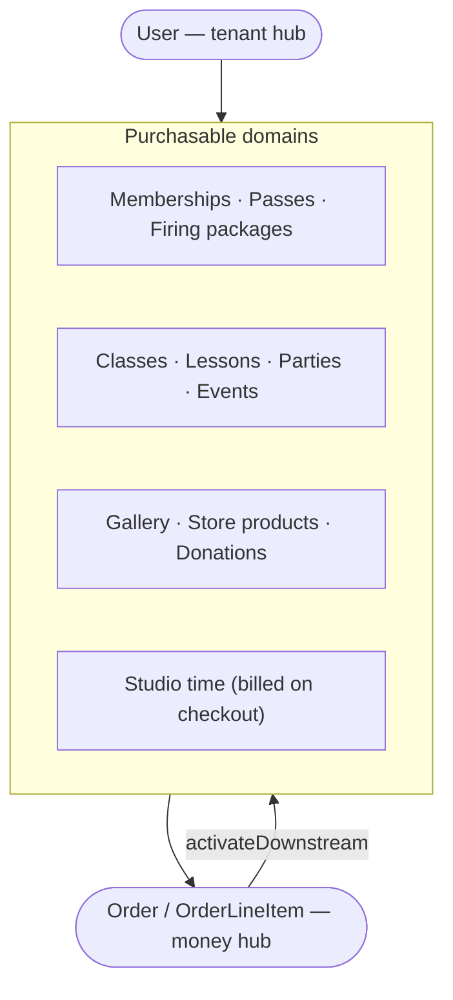
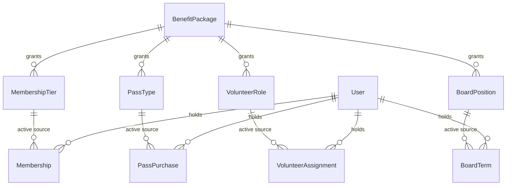
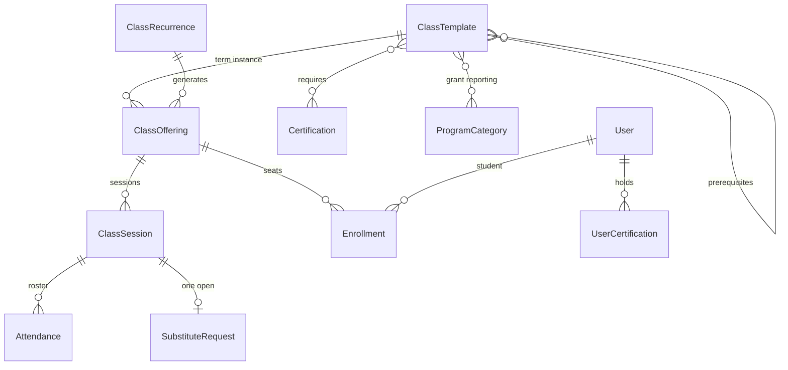
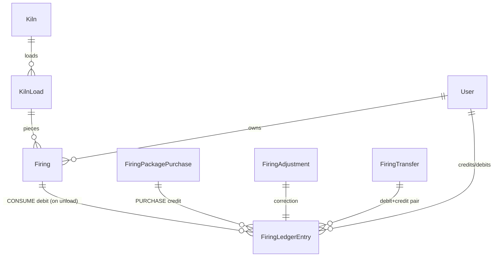

# 12. Data Model

A distilled view of the schema (174 models; 269 tenant + 46 central
migrations). The code repo's [`docs/ERD.md`](https://github.com/TitaniaAnn/makerhearth-laravel/blob/main/docs/ERD.md)
carries the full per-domain Mermaid ER diagrams generated from the Eloquent
models; this document captures the **shape** — the hubs, the join conventions,
and the structural patterns a schema reader needs first.

## The three hubs

- **`User` (tenant)** — the tenant-side hub. Role **flags**, not a roles table
  (`is_studio_staff`, `is_member`, `is_teacher`, `is_board`, `is_volunteer`,
  `is_artist`, `is_monitor`, `is_development_staff`). Role-specific data hangs
  off **tabbed `hasOne` profile extensions** (`TeacherProfile`,
  `VolunteerProfile`, `ArtistProfile`, `DonorProfile`) — `User` is never
  subclassed.
- **`Order` / `OrderLineItem` (tenant)** — the money hub. Every purchasable
  domain joins the money domain through line items.
- **`PlatformAdmin` (central)** — the operator hub: activity log, tickets,
  impersonation grants.

## The `source_*` join convention

`CartLineItem` / `OrderLineItem` carry a fan of **nullable `source_*_id`
columns** (`source_class_offering_id`, `source_studio_session_id`,
`source_event_ticket_id`, `source_donation_id`, `source_gallery_item_id`, …)
plus a `product_type` enum. On the cart these are deliberately
FK-constraint-free (avoids circular FKs); they are how activation finds its way
back from a paid order line to the pending domain row. This is the single most
important schema idiom to know when reading the money domain.

## Structural patterns in the schema

| Pattern | Tables |
|---|---|
| **Immutable ledger** (balance computed) | `firing_ledger_entries`, `store_credit_entries`, `pass_redemptions`, `free_class_ledger_entries`, `gallery_sales` |
| **Append-only history/audit** | `waiver_signatures` (+ separate `waiver_revocations`), `donor_interactions`, `grant_application_status_histories`, `tenant_ticket_status_histories`, `platform_admin_activity_logs`, `automated_email_deliveries`, `bcp_events` |
| **Snapshot-on-purchase** (frozen price/terms) | `cart_line_items`, `order_line_items`, `pass_purchases`, `firing_package_purchases`, `payroll_export_line_items`, `tax_receipts.donations_json` |
| **Per-tenant singleton** (`current()`) | `studio_settings`, `embed_settings`, `site_chromes`, `checkout_ctas` |
| **Partial unique indexes** (one-active-row-per-key) | monitor shifts `(monitor, terminal) WHERE closed_at IS NULL`, substitute requests per session, suppressions `(LOWER(email), source) WHERE released_at IS NULL`, tax receipts `(donor, tax_year)` |
| **Dedup stamp columns** | `reminder_<window>_sent_at`, `stewardship_*_sent_at`, `churn_warning_sent_at`, `email_sent_at`, … |
| **Read-model mapping** (no duplicate table) | `TeacherPayout` → `payroll_export_line_items` |
| **STI** | `ClayProduct extends Product` (discriminated by category) |
| **Denormalized pointer + source of truth** | `users.guardian_id` (cache) ← `guardian_relationships` (truth); `gallery_items.sold_at` (live status) + `gallery_sales` (ledger) |

## The benefit/catalog spine

`BenefitPackage` is referenced by the four benefit **sources** —
`MembershipTier`, `PassType`, `VolunteerRole`, `BoardPosition` — and unioned at
runtime by `BenefitResolver` (a service, not a table). Tier gating adds
`required_membership_tier_id` + `tier_price_override` (level-keyed JSON) to
every catalog table (`pass_types`, `class_offerings`, `event_ticket_types`,
`products`, `firing_package_products`).

## The classes spine

Template vs. offering matters: durable configuration (prerequisites, required
certifications, program-category tags, materials, FMV defaults) lives on the
**template** so every term's offering inherits it; per-term state (capacity,
schedule, price, tier gate) lives on the **offering**.

## Firing spine

## Central schema (platform)

`tenants`/`domains` (+ denormalized `stripe_connect_account_id`),
`platform_admins` → activity log / impersonation grants, `plan_tiers`/`addons`
→ `tenant_plans` → `platform_billing_events`, `system_error_groups` →
`_occurrences`, `tenant_tickets` → comments/status history,
`tenant_signup_attempts`, usage snapshots, `deleted_tenant_tombstones`, and the
platform email-automation twin (`platform_email_automations`/`_steps`/
`_automated_email_deliveries`). No cross-schema FKs — central rows reference
tenant ids/user ids as plain values.

## Reading order

1. This document (shape + idioms).
2. The code repo's `docs/ERD.md` (all per-domain diagrams).
3. `.design-docs/MODELS.md` (the authoritative 4,400-line pseudocode spec) for
   field-level semantics and edge cases.
