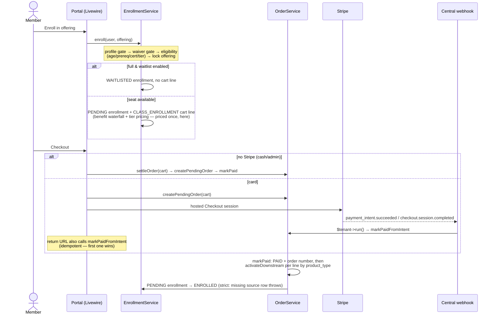
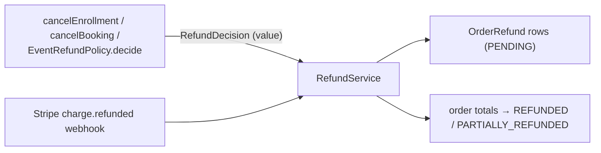
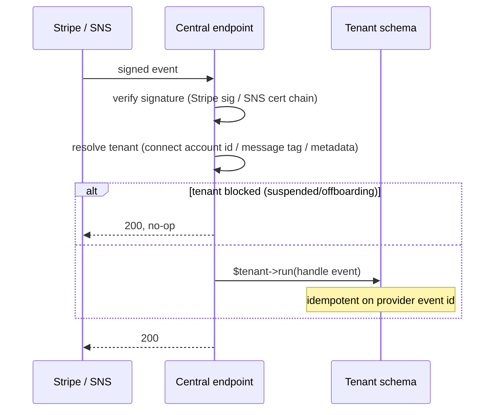

# 13. Key Flows

The dynamic view: what calls what, in what order, and where the invariants
live. Traced from the real service code (the code repo's `docs/DOMAIN_GUIDE.md`
is the file-linked companion).

## 13.1 Enrollment → cart → checkout → activation

The canonical money flow — every purchasable thing rides the same rails.

Invariants: the cart line is the **only** place price is computed (activation
snapshots, never re-prices); `markPaid` is idempotent (already PAID returns
unchanged); a CLASS_ENROLLMENT pass credit or a 100% benefit comp short-circuits
to a free seat with **no cart line**.

## 13.2 Waitlist promote-on-cancel

`EnrollmentService::cancel()` frees the seat (money movement is *not* here);
if the cancelled row held a seat, the lowest-position WAITLISTED enrollment is
promoted under `lockForUpdate()` → PENDING + a cart line, with a best-effort
offer email (send failure logs, never blocks the promotion).

## 13.3 Firing: credit in, consume out

- **Credit in:** firing-package activation writes a `PURCHASE` ledger entry
  (cubic inches, package expiry).
- **Consume out:** on `KilnLoadService::markUnloaded()` — never earlier, so
  pieces in damaged/ABORTED loads never bill. Wrapped in `DB::transaction`,
  starting with `User::lockForUpdate()` so two simultaneous unloads can't both
  read the same balance and drive it negative.
- **Transfers** lock both users in **PK-sorted order** (deadlock avoidance) and
  write a debit+credit pair. Corrections append new entries; nothing is edited.
- **Notifications:** ready-for-pickup (first touch on unload), stale-pickup
  nag, and staff stuck-load reminders — each one-shot via its own dedup column.

## 13.4 Studio time & POS checkout

Kiosk check-in has no auth (physical presence is the attestation; email, PIN,
or QR). Checkout bills billable minutes as a `STUDIO_TIME` cart line
(represents past consumption — no activation needed at PAID), records a
`PassRedemption` when an active pass covers the visit, and fires the
studio-hours milestone hook post-commit. Capacity hard-stops at
`max_concurrent_sessions` with a soft warning banner near the cap.

On the POS the same `StudioTimeService` path runs via `PosCheckoutService`,
additionally stamping the closing **monitor shift** — every POS checkout, sale,
and refund is shift-attributed, and a stale shift (inactivity lock) refuses
transactions until the monitor's PIN resumes it.

## 13.5 Refund: decision, then movement

Policy (windows, tiers, amounts) is pure and unit-testable; money movement is
separate and auditable. Stripe remains the source of truth for refunded
amounts (`syncFromStripeCharge` mirrors them); without Stripe, PENDING rows are
settled out-of-band by staff. POS monitor refunds add a cap check and a
one-pending-per-order guard under an order row-lock.

## 13.6 Membership lifecycle

Activate at order PAID (`MembershipService::activate` + best-effort Connect
subscription creation) → sync from `customer.subscription.*` webhooks →
daily expiry sweep flips past-`end_date` ACTIVE rows to CANCELLED → churn
warning one-shot per cancel cycle. `is_member` is recomputed, never hand-set.

## 13.7 Webhook tenant resolution (all inbound webhooks)

## 13.8 Email fire (every transactional communication)

Domain event → `EmailAutomationDispatcher::fire(trigger, context, recipient,
dedupKey)` → resolve the studio's automation (or the seeded default copy) →
opt-out + suppression gates (system triggers skip opt-out, never suppression)
→ pick the A/B arm (sticky hash) → route through the channel driver (EMAIL
sends; SMS/push send or record a typed skip) → immutable
`AutomatedEmailDelivery` row. Drip steps queue the tenant-aware job instead of
sending inline. Domain-side hooks are **best-effort post-commit** — a
messaging failure never disturbs the domain action.

## 13.9 Tenant provisioning (self-serve)

`/plans` → `/signup?plan=` → validate (DNS-label subdomain, reserved words,
uniqueness) → record a `TenantSignupAttempt` → (priced tier + configured
platform Stripe) hosted Checkout with trial, payload stashed server-side →
`TenantProvisioner`: tenant + domain + migrate schema + founding owner + TRIAL
plan → bind the Stripe subscription if one was created. Failures mark the
attempt FAILED and feed the hourly recovery-email cron.

## 13.10 BCP offline reconcile

The designated device holds an HMAC-signed, TTL'd snapshot (users + PINs +
balances + waiver state + retail catalog) for **display only**. Offline events
(check-in/out, signatures, cart lines, checkout) queue in IndexedDB and replay
through the **normal service entry points** on reconnect — idempotent per
`event_uuid`; the server's current state drives billing/eligibility, and drift
is recorded as a `BcpReconciliationAnomaly` (hard-stop vs. advisory classes),
never auto-resolved. Offline checkouts land AWAITING_PAYMENT; optional
auto-invoicing issues a Stripe send-invoice when configured.
