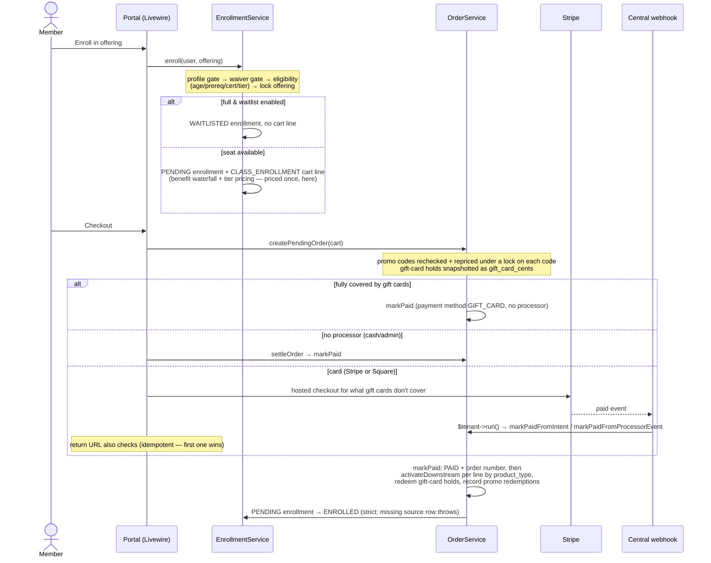
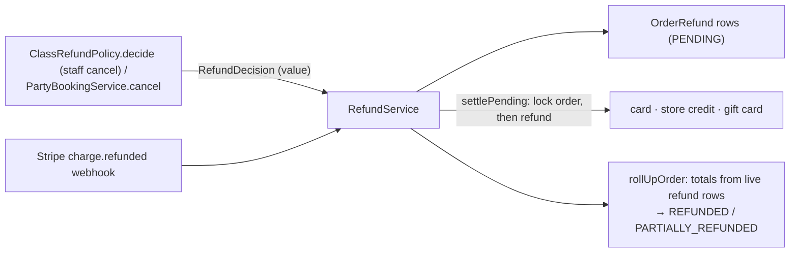
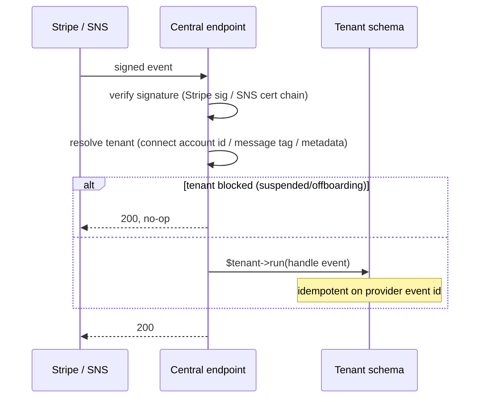
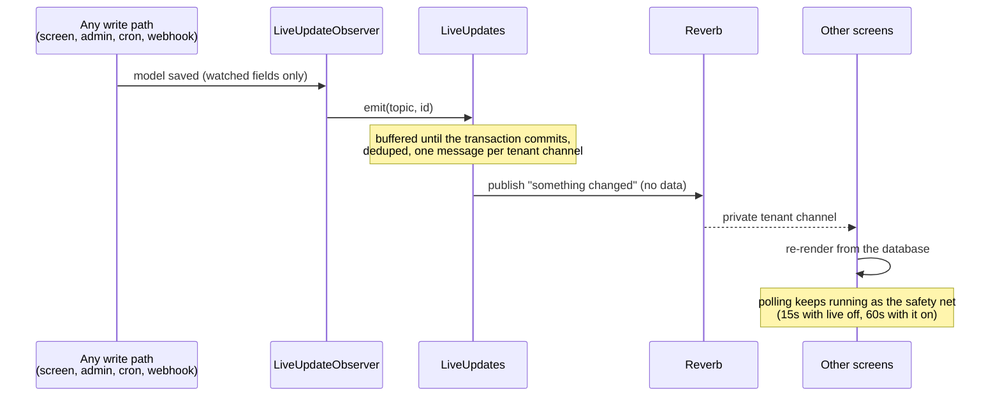

# 13. Key Flows

The dynamic view: what calls what, in what order, and where the invariants
live. Traced from the real service code (the private production repo's `docs/DOMAIN_GUIDE.md`
is the file-linked companion).

## 13.1 Enrollment → cart → checkout → activation

The canonical money flow — every purchasable thing rides the same rails.

Invariants: the cart line is the **only** place price is computed (activation
snapshots, never re-prices; tax is computed there too and included in the
line total); `markPaid` is idempotent (already PAID returns unchanged); a
CLASS_ENROLLMENT pass credit or a 100% benefit comp short-circuits to a free
seat with **no cart line**. Stripe Checkout gets one line per cart line at
its total, or a single "Order balance" line when gift cards or credit are
involved (Stripe has no negative lines).

## 13.2 Waitlist promote-on-cancel

`EnrollmentService::cancel()` frees the seat (money movement is *not* here);
if the cancelled row held a seat, the lowest-position WAITLISTED enrollment is
promoted under `lockForUpdate()` → PENDING + a cart line, with a best-effort
offer email (send failure logs, never blocks the promotion).

## 13.3 Firing: credit in, consume out

- **Credit in:** firing-package activation writes a `PURCHASE` ledger entry
  (cubic inches, package expiry).
- **Consume out:** at front-desk drop-off (`FiringService::dropOff`), one
  record per firing; no kiln step charges, so billing never depends on what a
  load contains and a failed firing is refired free. Wrapped in
  `DB::transaction`, starting with `User::lockForUpdate()` so two simultaneous
  charges can't both read the same balance and drive it negative.
- **Transfers** lock both users in **PK-sorted order** (deadlock avoidance) and
  write a debit+credit pair. Corrections append new entries; nothing is edited.
- **Notifications:** ready-for-pickup (first touch on unload), stale-pickup
  nag, and staff stuck-load reminders — each one-shot via its own dedup column.

## 13.4 Studio time & POS checkout

Kiosk check-in has no auth (physical presence is the attestation; email, PIN,
or QR). Checkout bills billable minutes as a `STUDIO_TIME` cart line
(represents past consumption — no activation needed at PAID), records a
`PassRedemption` when an active pass covers the visit, and fires the
studio-hours milestone hook post-commit. Capacity hard-stops at
`max_concurrent_sessions` with a soft warning banner near the cap.

On the POS the same `StudioTimeService` path runs via `PosCheckoutService`,
additionally stamping the closing **monitor shift** — every POS checkout, sale,
and refund is shift-attributed, and a stale shift (inactivity lock) refuses
transactions until the monitor's PIN resumes it.

POS sales snapshot the patron's cart into a PENDING order. A card-reader
charge then prompts the reader; the order settles from the processor's
webhook, and the screen also polls the processor so a missed webhook never
strands the monitor. Several terminals can be open at once and a patron's
cart is shared between them, so each charge carries the cart line ids its
screen showed and is refused under the cart lock if another terminal
changed the cart. Cash tenders open the drawer through the receipt printer
(when one is paired), and every drawer opening is an immutable record.

## 13.5 Refund: decision, then movement

Policy (windows, tiers, amounts) is pure and unit-testable; money movement is
separate and auditable. Stripe remains the source of truth for refunded
amounts (`syncFromStripeCharge` mirrors them); without Stripe, PENDING rows are
settled out-of-band by staff. POS monitor refunds add a cap check and a
one-pending-per-order guard under an order row-lock. Tax is returned in
proportion to the amount refunded.

## 13.6 Membership lifecycle

Activate at order PAID (`MembershipService::activate` + best-effort Connect
subscription creation) → sync from `customer.subscription.*` webhooks →
daily expiry sweep flips past-`end_date` ACTIVE rows to CANCELLED → churn
warning one-shot per cancel cycle. `is_member` is recomputed, never hand-set.
Every one of those steps writes an append-only `MembershipLifecycleEvent`
from inside `MembershipService`, which is what the growth metrics read.
Space rentals follow the same subscription shape on the studio's Stripe
account, with the extra wrinkle that a staff-scheduled end is pushed to
Stripe as `cancel_at`, and changes that came *from* Stripe are flagged so
they aren't echoed back.

## 13.7 Webhook tenant resolution (all inbound webhooks)

## 13.8 Email fire (every transactional communication)

Domain event → `EmailAutomationDispatcher::fire(trigger, context, recipient,
dedupKey)` → resolve the studio's automation (or the seeded default copy) →
opt-out + suppression gates (system triggers skip opt-out, never suppression)
→ pick the A/B arm (sticky hash) → route through the channel driver (EMAIL
sends; SMS/push send or record a typed skip) → immutable
`AutomatedEmailDelivery` row. Drip steps queue the tenant-aware job instead of
sending inline. Domain-side hooks are **best-effort post-commit** — a
messaging failure never disturbs the domain action.

## 13.9 Tenant provisioning (self-serve)

`/plans` → `/signup?plan=` → validate (DNS-label subdomain, reserved words,
uniqueness) → record a `TenantSignupAttempt` → (priced tier + configured
platform Stripe) hosted Checkout with trial, payload stashed server-side →
`TenantProvisioner`: tenant + domain + migrate schema + founding owner + TRIAL
plan → bind the Stripe subscription if one was created. Failures mark the
attempt FAILED and feed the hourly recovery-email cron.

## 13.10 Gift card: sell, apply, redeem, refund

Selling adds a GIFT_CARD cart line pointing at a card with **no code yet**.
At `markPaid` the card is issued: row-locked, idempotent, an ISSUE ledger
entry, and a code generated and emailed (as a secret token, so the stored
delivery row keeps only the last four). Spending it applies a hold to an
open cart; `createPendingOrder` snapshots the holds as `gift_card_cents`;
`markPaid` turns holds into REDEEM entries (a card whose balance dropped
pays what it has, and the order's gift-card part is lowered and logged). A
refund to the gift card writes REFUND entries, first card first.

## 13.11 Live update (multi-screen freshness)

The message carries only a topic and an id; screens always read the database
on receipt, so a dropped or forged message can't show wrong data. One
observer holds the whole model → topic mapping, so admin edits, crons and
webhooks push updates without each write path knowing about it. A failed
publish is reported and swallowed; it never fails the write.

## 13.12 Accounting sync

`accounting:sync` (daily) refreshes the provider token if it's near expiry
(a refused refresh marks the connection "needs reconnect" and stops), then
sends each complete studio-local day without a posted record, or, in
per-sale mode, each paid order and completed refund. A day already posted
as a summary is never also sent sale-by-sale, and vice versa. Every category
the entry uses must be mapped to an account in the studio's books, or the
record is FAILED with a message naming the missing ones.

## 13.13 BCP offline reconcile

The designated device holds an HMAC-signed, TTL'd snapshot (users + PINs +
balances + waiver state + retail catalog) for **display only**. Offline events
(check-in/out, signatures, cart lines, checkout) queue in IndexedDB and replay
through the **normal service entry points** on reconnect — idempotent per
`event_uuid`; the server's current state drives billing/eligibility, and drift
is recorded as a `BcpReconciliationAnomaly` (hard-stop vs. advisory classes),
never auto-resolved. Offline checkouts land AWAITING_PAYMENT; optional
auto-invoicing issues a Stripe send-invoice when configured.
